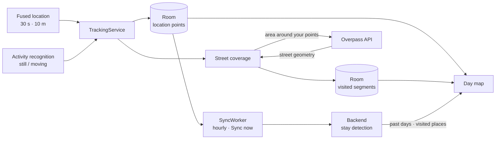

# Street Viewer (Android)

A personal GPS tracker for Android. It records where you move, uploads the track to a small
self-hosted backend, and shows each day's route on a map along with the places you stayed and
the streets you've covered on foot, either by walking or running.

The backend lives in a separate repo: **[Street_viewer_api](https://github.com/DanielOfRivia/Street_viewer_api)**.

## Features

- **Background tracking**: a foreground service records a GPS fix every 30 seconds (and only
  after moving 10 m). Fixes accurate to 200 m are kept, so indoor stays still get points; only
  fixes accurate to 50 m are drawn on the track or used for street coverage.
- **Battery-aware**: with the optional *Physical activity* permission, GPS switches off while
  you're stationary and comes back when you start moving (Activity Recognition Transition API).
- **Offline-first**: points are stored on-device (Room) and uploaded hourly by WorkManager,
  or on demand with *Sync now*. Synced points are kept locally for 30 days.
- **Day map**: pick any day to see its track, direction arrows, and the places you stayed
  (detected server-side, with address and businesses at that spot).
- **Street coverage**: streets you've walked are coloured on the map. Street geometry comes
  from OpenStreetMap via the public [Overpass API](https://overpass-api.de/). Anything faster
  than 15 km/h (cycling, driving, transit) is ignored. To change the limit, edit `maxSpeedKmh`
  in `domain/LocationGapFiller.kt` and bump `KEY_REBUILT` in `App.kt`, so existing coverage is
  recomputed on the next app start.
- **Survives reboots**: if tracking was on, it restarts after boot, or posts a notification
  to resume it when Android doesn't allow a location service to start in the background.

## How it works



**Recording.** `TrackingService` requests high-accuracy fixes every 30 s, delivered only after
10 m of movement. With the *Physical activity* permission it also subscribes to
still/moving transitions:

- **On becoming still**, it takes one fresh fix at the spot, then switches to a passive request,
  turning the GPS off.
- **On moving again**, it records a point at the stay's position timestamped at that moment,
  then switches back to high accuracy. This point is *inferred*, not measured: activity
  recognition reports you hadn't moved. It keeps the stay's end at the place, rather than
  wherever the first fix lands after the GPS warms up.

Android can take several minutes to report stillness after you stop moving, so short stops are
recorded at full GPS power.

**Syncing.** `SyncWorker` uploads unsynced points in pages of 500 every hour when there's a
network, or immediately on *Sync now*. The backend ignores duplicates, so retries are safe.
Synced points are deleted from the phone after 30 days.

**Stays** are detected by the backend (at least 20 minutes within 200 m) and shown as pins on the
day map. See the [backend README](https://github.com/DanielOfRivia/Street_viewer_api).

**Street coverage** is computed on the phone:

1. Only fixes accurate to 50 m are used.
2. Points only reachable at more than 15 km/h are dropped.
3. Gaps of under 90 s between the remaining points are filled with a synthetic point every 30 m.
4. An OpenStreetMap street segment counts as visited if any point lies within 30 m of it. Only
   streets count (`residential` up to `motorway`), not footways, cycleways or service roads.

Street geometry is fetched from Overpass for a box around your points padded by about 1 km, and
cached in memory until you move outside it. Coverage updates with each new fix and is fully
rebuilt from your entire history whenever the matching rules change.

## Requirements

- Android Studio (recent stable; AGP 9.x, Kotlin 2.2)
- An Android 10+ device or emulator (minSdk 29) with Google Play services
- A Google Maps SDK for Android API key
- A running instance of the [backend](https://github.com/DanielOfRivia/Street_viewer_api)

## Setup

1. Clone the repo and open it in Android Studio.
2. Create `local.properties` in the project root (it's gitignored; Android Studio usually
   creates it with `sdk.dir` already set) and add:

   ```properties
   # Google Maps SDK for Android key (see "Maps API key" below)
   MAPS_API_KEY=your-maps-sdk-key

   # Backend base URL for debug builds (trailing slash required).
   # Default when omitted: http://10.0.2.2:8080/ (the host machine, from the emulator).
   BASE_URL_DEBUG=https://your-tunnel.ngrok-free.app/

   # The backend's API_KEY, sent as the X-API-Key header. The name is historical: it's used
   # for whatever backend BASE_URL_* points at, not only ngrok.
   NGROK_SECURE_API_KEY=your-backend-api-key

   # Optional: backend URL for release builds.
   # BASE_URL_RELEASE=https://api.example.com/
   ```

3. Start the backend (see its README), then run the `app` configuration.
4. In the app, tap **Start** and grant location, notifications and (optionally) physical
   activity.

To reach a backend on your computer from a physical phone, expose it with a tunnel such as
[ngrok](https://ngrok.com/) and put the tunnel URL in `BASE_URL_DEBUG`.

### Maps API key

The key ends up inside the APK, where anyone can extract it, so restrict it in
[Cloud Console](https://console.cloud.google.com/apis/credentials) in both of these ways:

- **Application restrictions → Android apps**: package `io.github.DanielOfRivia.street_viewer_v2`
  plus the SHA-1 of each signing certificate (`./gradlew signingReport` shows the debug one).
- **API restrictions → Maps SDK for Android** only. The Android restriction alone isn't enough:
  it's checked via request headers anyone can send, so without this the key also works for paid
  web APIs such as Geocoding.

Map loads through the Maps SDK are free with no usage limit. The app uses no other Google API that
takes a key.

## Permissions

| Permission | Why |
|---|---|
| Fine / coarse location | Recording the track (foreground service, while-in-use) |
| Notifications | The ongoing "tracking" notification |
| Physical activity | *Optional.* Turns GPS off while stationary to save battery |
| Boot completed | Resuming tracking after a restart |

Background location permission is deliberately not requested.

## Security

- **Don't distribute your builds.** The backend URL and `NGROK_SECURE_API_KEY` are compiled into
  the APK, and anyone with a copy can extract them and read your entire location history. Each
  person should build the app against their own backend.
- **Restrict the Maps key** as described in [Maps API key](#maps-api-key).
- **Debug builds log HTTP traffic** to logcat, including your coordinates. The `X-API-Key` header
  is redacted. Release builds log nothing.

## Privacy

The app has no analytics or third-party tracking. Your location still reaches these parties:

| Recipient | What | When |
|---|---|---|
| Your backend | Every recorded point (coordinates, time, accuracy) | Each sync |
| [Overpass API](https://overpass-api.de/) (public service) | A bounding box around your recent points, padded by about 1 km. A rebuild sends the box around your entire history | When you move outside the cached area, and once per matching-rule change |
| Google | Map tile requests for the areas you view. Location and activity recognition run in Google Play services | While viewing the map or tracking |
| Google backups | App data, including the location database, if Android backup is on | Periodically |

To keep the location database out of backups, exclude the `databases` domain in
`app/src/main/res/xml/data_extraction_rules.xml` and `backup_rules.xml`.

## Project structure

```
app/src/main/java/.../street_viewer_v2/
├── data/      Room database, Retrofit API, Overpass client, repository implementations
├── di/        Hilt modules
├── domain/    Models, repository interfaces, geometry and track-processing logic
├── service/   Tracking foreground service, sync worker, activity monitor, boot receiver
└── ui/        Compose screens: tracking controls and the day map
```

## Tests

```bash
./gradlew testDebugUnitTest          # JVM unit tests
./gradlew connectedDebugAndroidTest  # instrumented tests (needs a device or emulator)
```

## License

[MIT](LICENSE)
